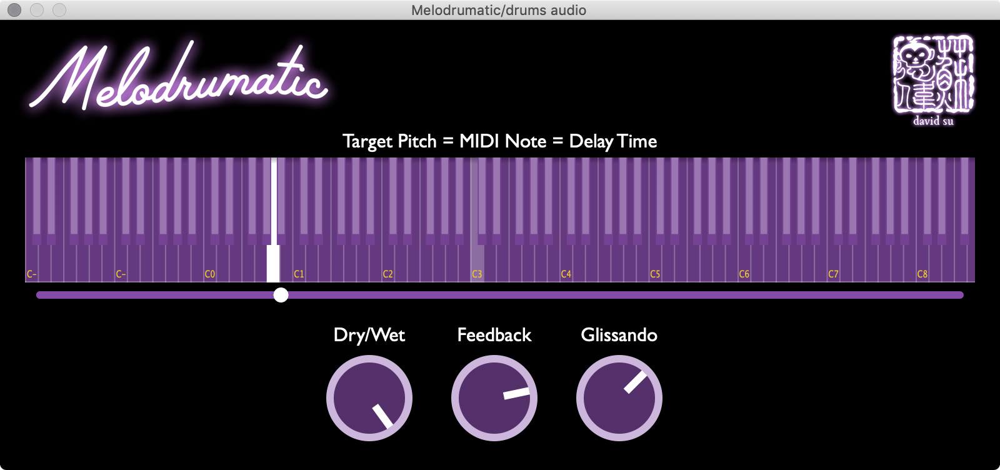
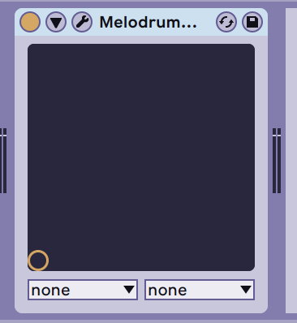
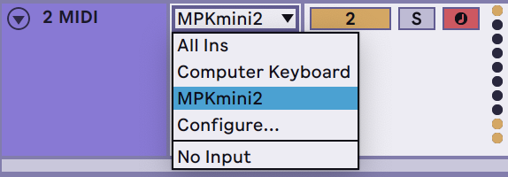
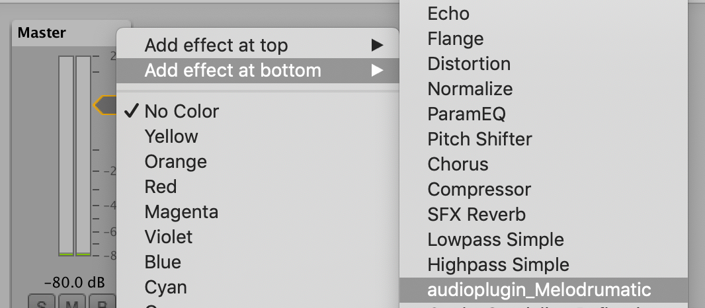

# Melodrumatic



## Overview
Melodrumatic is an audio plugin that lets you "pitch-shift" via delay (i.e. the Doppler effect) to turn unpitched audio into melodies. Controllable via MIDI or mouse :)

Demo video: https://youtu.be/KpkDhlis1zw

## Available Formats
VST3, AU, AAX, Unity

## Installation
Download the latest version of Melodrumatic from the [releases](https://github.com/usdivad/Melodrumatic/releases) page, then unzip and place the individual files into the appropriate plugin folders for your respective DAWs (or Unity!)

For Mac, this usually means:
```
VST3  -->  ~/Library/Audio/Plug-Ins/VST3
AU    -->  ~/Library/Audio/Plug-Ins/Components
AAX   -->  /Library/Application Support/Avid/Audio/Plug-Ins
Unity -->  [YourProjectName]/Assets/Plugins
```

And for Windows, this usually means:
```
VST3  -->  C:\Program Files\Common Files\VST3
AU    -->  Not supported :(
AAX   -->  C:\Program Files\Common Files\Avid\Audio\Plug-Ins
Unity -->  [YourProjectName]\Assets\Plugins
```

For Unity projects, install the plugin (*audioplugin_Melodrumatic.bundle*) into `[YourProjectName]/Assets/Plugins`.


## Usage

### For DAWs
*(NOTE: The screenshot examples are in Ableton Live, but the steps should be relatively similar for any DAW you use; currently the plugin has been tested with Ableton Live, Logic Pro X, and REAPER)*

**1.** Insert Melodrumatic as an effect on the track whose output you'd like to pitch-shift (this can be either an audio or a MIDI track).



**2.** Create a MIDI track.


**3.** Route the MIDI track's output to the track that Melodrumatic resides on...


... and specifically to Melodrumatic.


**4.** (optional) If you have an external MIDI controller, assign that as the input to your MIDI track so that you can control Melodrumatic live!




### For Unity

**1.** Insert Melodrumatic as an effect onto the desired Audio Mixer (the plugin will show up as `audioplugin_Melodrumatic`).


**2.** (optional) Right-click parameters and select "Expose `parameterName` to script" in order to control Melodrumatic through scripting!


*NOTE: Since the Unity plugin normalizes parameter values to a 0-1 range, in order to treat the Delay Time parameter as MIDI notes you'll need to re-scale the values. This can be done by quantizing values to steps of 0.0078125 (i.e. 1/128).*

## Contact
Please [get in touch](mailto:hello@usdivad.com) if you end up making any cool music, sounds, or games using this, as well as if you have any questions or comments!